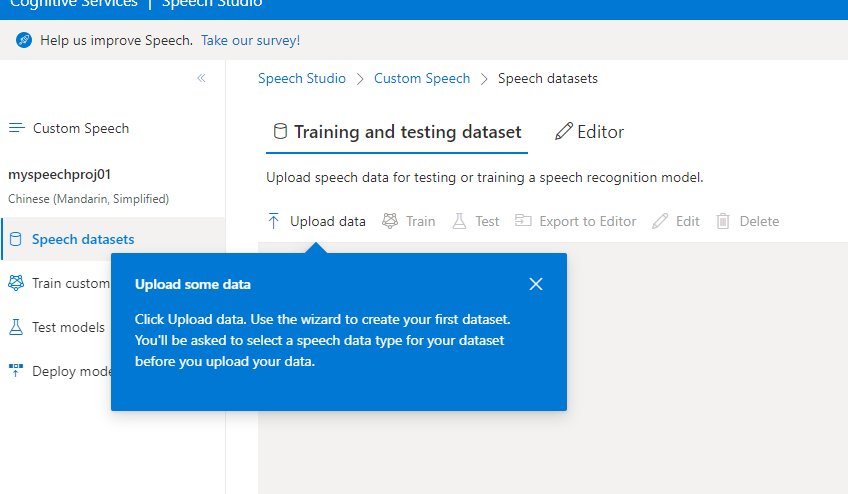

# Azure AI产品资源

- [微软认知服务](https://azure.microsoft.com/zh-cn/services/cognitive-services/)
- Microsoft Speech 参考文档

  - 心智互动主要用在翻译服务。即文字翻译后再转为语音服务

    - 语音服务
      - 语音转文字(STT)

        https://azure.microsoft.com/zh-cn/services/cognitive-services/speech-to-text/#overview
      - 文字转语音(TTS)
    - 翻译服务
  - 自定义 语音合成服务

    - 语音合成
      https://speech.microsoft.com/audiocontentcreation

      
    - 自定义语音服务

      1. [订阅和创建项目](https://docs.microsoft.com/zh-cn/azure/cognitive-services/speech-service/custom-speech-overview#set-up-your-azure-account)。 创建 Azure 帐户并订阅语音服务。 此统一订阅使你可以访问语音转文本、文本转语音、语音翻译和 [Speech Studio](https://speech.microsoft.com/customspeech)。 然后，使用语音服务订阅创建第一个“自定义语音识别”项目。
      2. [上传测试数据](https://docs.microsoft.com/zh-cn/azure/cognitive-services/speech-service/how-to-custom-speech-test-and-train)。 上传测试数据（音频文件），以便针对你的应用程序、工具和产品评估 Microsoft 语音转文本产品/服务。
      3. [检查识别质量](https://docs.microsoft.com/zh-cn/azure/cognitive-services/speech-service/how-to-custom-speech-inspect-data)。 使用 [Speech Studio](https://speech.microsoft.com/customspeech) 播放上传的音频，检查测试数据的语音识别质量。 如需进行量化度量，请参阅[检查数据](https://docs.microsoft.com/zh-cn/azure/cognitive-services/speech-service/how-to-custom-speech-inspect-data)。
      4. [评估和提高准确度](https://docs.microsoft.com/zh-cn/azure/cognitive-services/speech-service/how-to-custom-speech-evaluate-data)。 评估和提高语音转文本模型的准确度。 [Speech Studio](https://speech.microsoft.com/customspeech) 会提供误字率，该指标可以用来确定是否需要更多的训练。 如果对准确度满意，可以直接使用语音服务 API。 如果想要将准确度提高 5% - 20%（相对平均值），请在门户中使用“训练”选项卡上传更多训练数据，例如人为标记的脚本和相关文本。
      5. [训练和部署模型](https://docs.microsoft.com/zh-cn/azure/cognitive-services/speech-service/how-to-custom-speech-train-model)。 提供编写的脚本（10-1,000 小时）和相关文本 (<200 MB) 以及音频测试数据，以便提高语音转文本模型的准确度。 该数据有助于训练语音转文本模型。 训练后，请重新测试。 如果对结果感到满意，则可将模型部署到自定义终结点。

      - https://docs.microsoft.com/zh-cn/azure/cognitive-services/speech-service/custom-speech-overview
      - https://docs.microsoft.com/zh-cn/azure/cognitive-services/speech-service/how-to-custom-speech-choose-model

        
    - Speech Studio 工作台

      - https://speech.microsoft.com/portal/customspeech

        

        

      

      

    

  

  

   
   
    
  - Microsoft Cognitive Services 自然语言处理服务

    - Luis 自然语言理解

      - 什么是语言理解 (LUIS) https://docs.microsoft.com/zh-cn/azure/cognitive-services/luis/what-is-luis

      * [**快速入门**](https://docs.microsoft.com/zh-cn/azure/cognitive-services/luis/luis-get-started-create-app)介绍了入门说明，指导您完成向服务发出请求。
      * [**操作指南**](https://docs.microsoft.com/zh-cn/azure/cognitive-services/luis/luis-how-to-start-new-app)包含以更具体的方式或自定义方式使用服务的说明。
      * [**概念**](https://docs.microsoft.com/zh-cn/azure/cognitive-services/luis/artificial-intelligence)对服务的功能和特性进行了深入说明。
      * [**教程**](https://docs.microsoft.com/zh-cn/azure/cognitive-services/luis/tutorial-intents-only)是较长的指南，向您演示了如何在更广泛的业务解决方案中使用该服务作为组件。
    - Azure Bot service
    - Bot Framework Composer
    - https://docs.microsoft.com/en-us/composer/install-composer?tabs=windows
