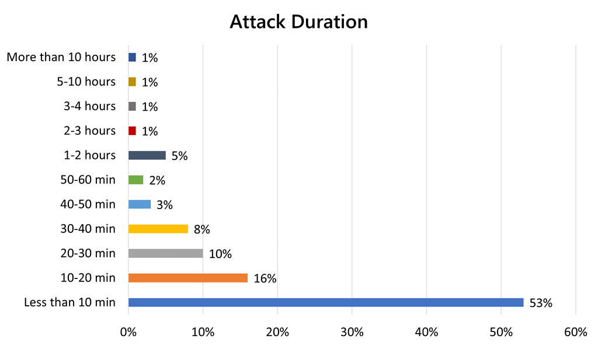
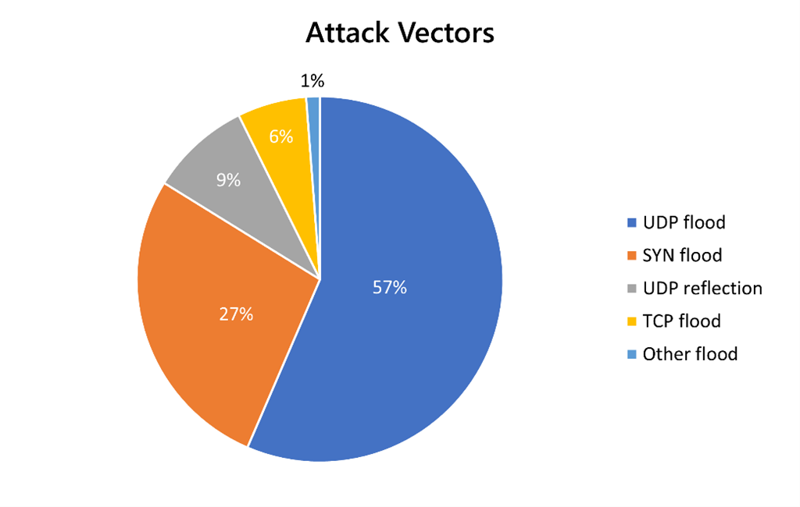
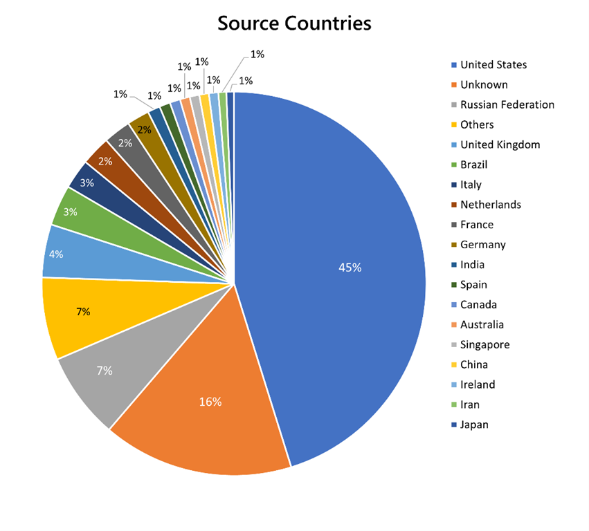
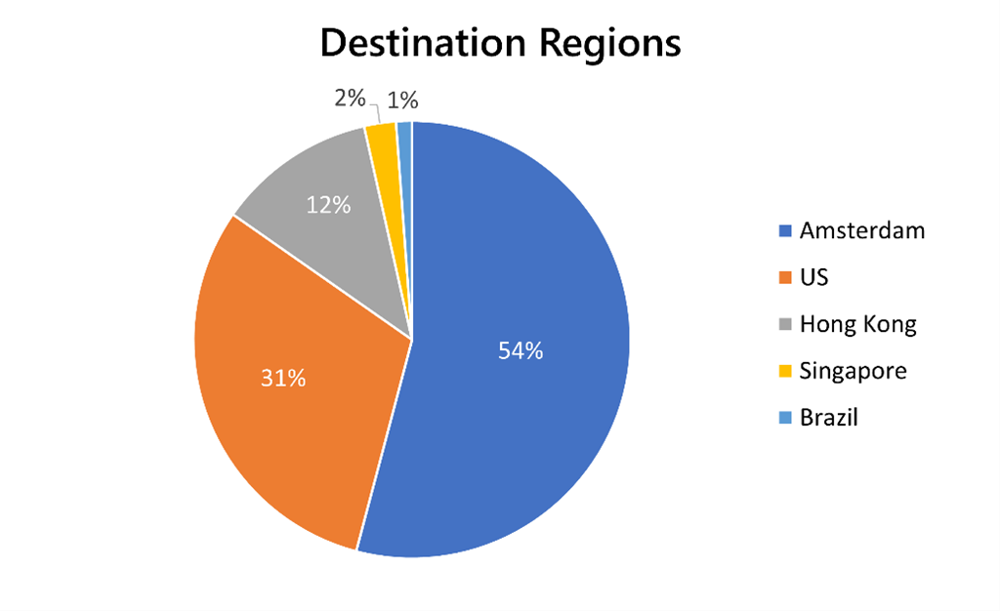

# Azure DDOS Pretection

## Azure DDOS basic migrated record

### Year 2020 Review

[ref link](https://azure.microsoft.com/en-us/blog/azure-ddos-protection-2020-year-in-review/ "2020 review link")

#### Attack bandwidth

1. Single public IP 1tbps
2. Reflection attack of 1.6 tbps to multiple customers

#### Attack Duration

1. 87% attack under 1 hour
2. 53% attack under 10 munites

#### Increase in User Datagram Protocol (UDP) flood and reflection attacks

1. The top attack vectors were User Datagram Protocol (UDP) flood attacks (**57%**)
2. SYN flood attacks (**27%**)
3. UDP reflection attacks (**9%**)
4. The top reflection attacks were DNS, NTP, CLDAP, WSD, SSDP, memcached, and OpenVPN.
   1. This is due to the rise in IoT-connected devices, with vulnerable operating systems that are exploited to build botnets and launch reflection attacks.

#### Wider range of attack sources and industries targeted

1. The top source countries to generate DDoS attacks were the United States and Russia, followed by the United Kingdom.
2. 

