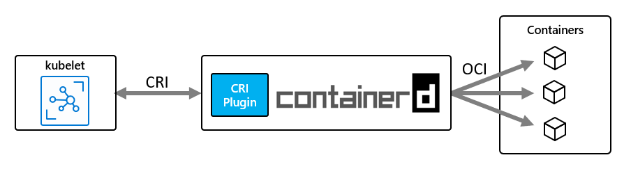

# AKS 学习笔记

## 添加tls 实现ingress的https访问

https://docs.microsoft.com/en-us/azure/aks/ingress-own-tls?tabs=azure-cli

https://docs.microsoft.com/en-us/azure/application-gateway/ingress-controller-expose-service-over-http-https

## Azure Kubernetes Service (AKS) support for containerd runtime is in preview

Azure Kubernetes Service (AKS) now supports creation of clusters and node pools with containerd, an industry-standard container runtime, in preview. Containerd enhances pod creation speed as well as stability.

During the public preview, users will be able to select containerd or Moby as their container runtime. Containerd will become the default container runtime for AKS when containerd support becomes generally available. Current users are encouraged to use the preview period to test their workloads on containerd node pools to ensure a smooth transition.

## 配置 AKS 群集

在创建 AKS 群集的过程中，你可能需要自定义群集配置来满足你的需求。 本文介绍了几个用于自定义 AKS 群集的选项。

## OS 配置

对于群集，AKS 支持将 Ubuntu 18.04 作为正式发布 (GA) 的默认节点操作系统 (OS)。

## 容器运行时配置

容器运行时是在节点上执行容器和管理容器映像的软件。 运行时有助于抽掉系统调用或操作系统 (OS) 特定功能，以便在 Linux 或 Windows 上运行容器。 对于 Linux 节点池，`containerd` 用于使用 Kubernetes 1.19 及更高版本的节点池。 对于 Windows Server 2019 节点池，`containerd` 已公开发布，并且可以在使用 Kubernetes 1.20 及更高版本的节点池中使用，但默认情况下仍使用 Docker。

[`Containerd`](https://containerd.io/) 是一个符合 [OCI](https://opencontainers.org/)（开放式容器计划）要求的核心容器运行时，该运行时提供在节点上执行容器和管理映像所需的最小功能集。 它是在 2017 年 3 月[捐赠](https://www.cncf.io/announcement/2017/03/29/containerd-joins-cloud-native-computing-foundation/)给云原生计算基金会 (CNCF) 的。 如上所示，AKS 使用的当前 Moby（上游 Docker）版本已经利用 `containerd` 并在此基础上进行构建。

如果使用了基于 `containerd` 的节点和节点池，kubelet 会通过 CRI（容器运行时接口）插件直接与 `containerd` 通信，而不是与 `dockershim` 通信，这样，流中就没有额外的跃点（与 Docker CRI 实现相比）。 因此，你会看到 Pod 启动延迟情况得到改善，资源（CPU 和内存）使用量降低。

通过对 AKS 节点使用 `containerd`，可以改善 Pod 启动延迟情况，并降低容器运行时的节点资源消耗。 这些改善是通过这个新体系结构实现的，其中的 kubelet 通过 CRI 插件直接与 `containerd` 通信，而在 Moby/docker 体系结构中，kubelet 则会在到达 `containerd` 之前与 `dockershim` 和 docker 引擎通信，因此在流中有额外的跃点。

`Containerd` 适用于 AKS 中的每个 Kubernetes GA 版本和每个高于 v1.19 的上游 Kubernetes 版本，并且支持所有 Kubernetes 和 AKS 功能。
