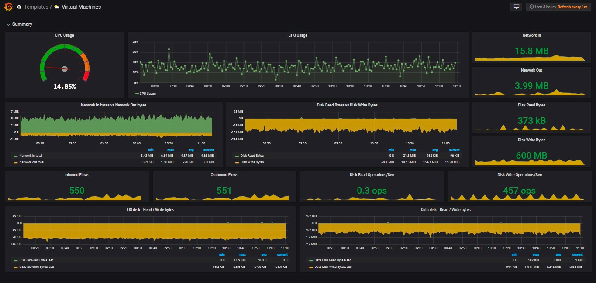

# Monitor

可视化地监控某台虚拟机，参考：

https://docs.microsoft.com/zh-cn/azure/virtual-machines/monitor-vm

如果是需要编程，Azure 有一组REST API 可供调用。

获取可以监控的指标列表：

https://docs.microsoft.com/zh-cn/rest/api/monitor/Metrics/List

查询虚拟机的各项监控指标，参考：

https://docs.microsoft.com/zh-cn/azure/virtual-machines/linux/metrics-vm-usage-rest

也可以把数据归集到Azure 自带的服务Azure Monitor 中监控，参考：

https://docs.microsoft.com/zh-cn/azure/azure-monitor/essentials/collect-custom-metrics-guestos-resource-manager-vm

https://docs.microsoft.com/zh-cn/azure/azure-monitor/insights/azure-networking-analytics

https://docs.microsoft.com/zh-cn/azure/virtual-network/virtual-machine-network-throughput

## 控制台中是否有实时可看的流量数据且支持导出，我们需要以此作为未来给客户结算使用。

最简单和直接的方法是用grafana，

请参考：

https://devblogs.microsoft.com/devops/monitoring-azure-by-using-grafana-dashboards

https://grafana.com/docs/grafana/latest/datasources/azuremonitor/

https://docs.microsoft.com/zh-cn/azure/azure-monitor/visualize/grafana-plugin

grafana dashboard 这里有现成的，不需要开发：https://github.com/yesoreyeram/grafana-dashboards

